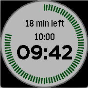
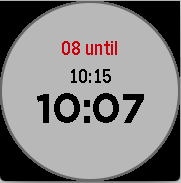
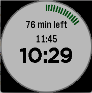

# pebble_round_watchface

This is a small Example for a round pebble watchface (for Pebble Round)

It is used in the context of lectures - there is a time-slot for each lecture during the day.
When the time for a lecture has come, the watchface displays how many minutes are left. 
The lecture times are from 08:30 to 10:00, 10:15 to 11:45, 12:00 to 13:30, 14:15 to 15:45 and
16:00 until 17:30.

Works with pebble sdk

This is how the watchface looks during a lecture.
The lecture started at 08:30, there are 18 minutes left and the green bars around the edge show, that more then 3/4 of the lecture is done:

This is inbetween lectures. The next lecture will start at 10:15, it is now 10:07. The watch says, that you have 8 minutes left:

A new lecture started. It will run until 11:45:

## Instructions

1. Get the pebble sdk
2. Run the following commands in the main directory
2. ``pebble build``
3. ``pebble install --emulator chalk``

